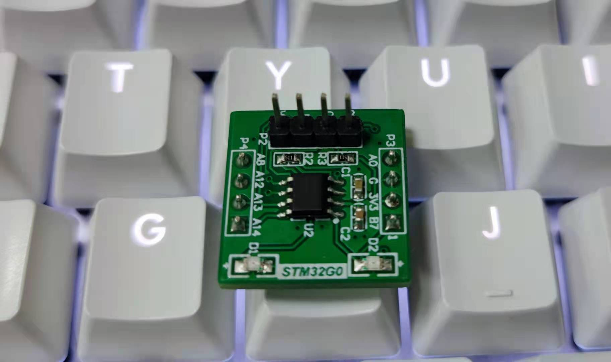

# [STM32G031](https://github.com/SoCXin/STM32G031)

* [ST](https://www.st.com/zh/): [Cortex-M0](https://github.com/SoCXin/Cortex)
* [L3R3](https://github.com/SoCXin/Level): 64 MHz (59 DMIPS, 142 CoreMark)

## [简介](https://github.com/SoCXin/STM32G031/wiki)

#### 关键特性

* 64 MHz主频，精确内部时钟
* 12bit ADC（2.5 MSps）
* 5ch x DMA

### [资源收录](https://github.com/SoCXin)

* [参考文档](docs/)
* [参考资源](src/)
* [参考工程](project/)
* [入门教程](https://docs.soc.xin/STM32G031.html)

### [选型建议](https://github.com/SoCXin)

[STM32G0](https://www.st.com/zh/microcontrollers-microprocessors/stm32g0-series.html)支持更广泛的封装和内存组合，同时具备STM32系列的基本功能，特别适合成本敏感型应用。

 [STM32G031](https://www.st.com/content/st_com/zh/products/microcontrollers-microprocessors/stm32-32-bit-arm-cortex-mcus/stm32-mainstream-mcus/stm32g0-series/stm32g0x1.html) 相较 [STM32G031](https://www.st.com/content/st_com/zh/products/microcontrollers-microprocessors/stm32-32-bit-arm-cortex-mcus/stm32-mainstream-mcus/stm32g0-series/stm32g0x0-value-line.html) 模拟升级功能并增加安全功能，最主要的包括新增 USB-PD/CAN-FD/AES256，产品的型号规格更加丰富。

#### 相关型号

STM32G0x1系列片上闪存的容量将支持从16KB到512KB，SRAM的容量可达144KB，封装的引脚数量范围将从8到100。STM32G031系列主要有5类引脚数量3种内存规格。

* STM32G031J:SO8N
* STM32G031F:TSSOP20
* STM32G031G:UFQFPN28/UFQFPN32
* STM32G031K:LQFP32/UFQFPN32
* STM32G031C:LQFP48/UFQFPN48

### 验证开发板

#### 高可用度开源项目

* [Arduino_Core_STM32](https://github.com/stm32duino/Arduino_Core_STM32)
* [STM32CubeG0](https://github.com/STMicroelectronics/STM32CubeG0)
* [rust API](https://github.com/stm32-rs/stm32g0xx-hal)

### [探索芯世界 www.SoC.xin](http://www.SoC.Xin)
